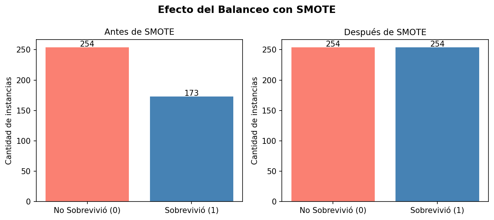
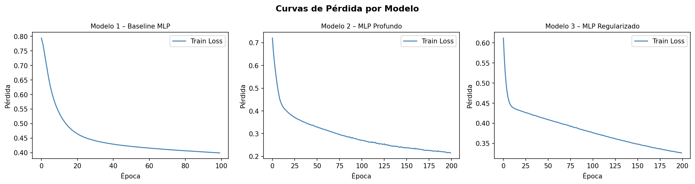
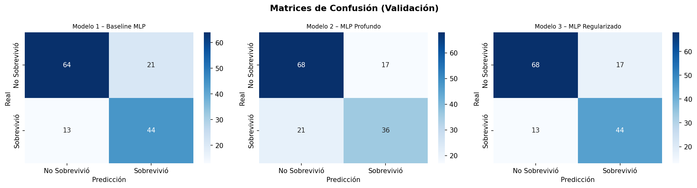
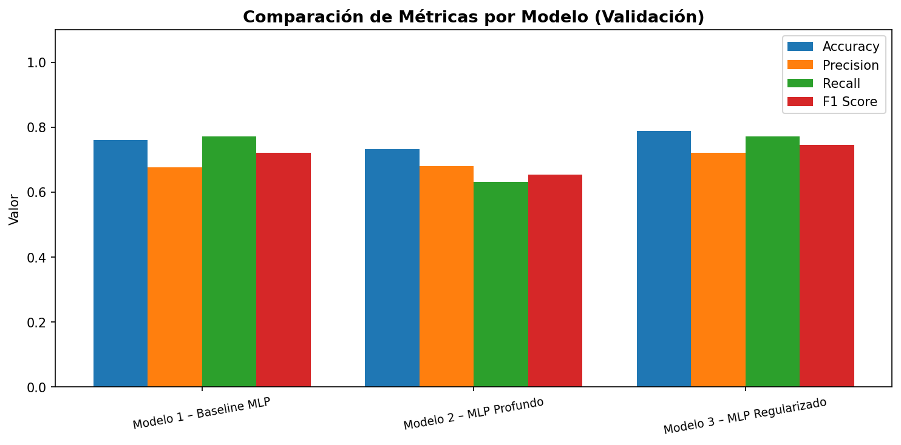

# TP5.1 – Clasificación con Redes Neuronales Artificiales (Titanic)

Trabajo Práctico 5.1 de Inteligencia Artificial No Simbólica.  
Implementación y comparación de tres arquitecturas MLP (`scikit-learn`) para predecir la supervivencia en el Titanic.

---

## Descripción

El pipeline completo incluye:

1. **Carga de datos** – dataset Titanic desde `seaborn` (891 pasajeros, 8 features)
2. **Preprocesamiento** – limpieza de nulos, codificación de variables categóricas, escalado con `StandardScaler`
3. **Balanceo** – SMOTE para corregir el desbalance de clases en train (549 / 342 → 254 / 254)
4. **Entrenamiento** – 3 modelos MLP con distintas arquitecturas y optimizadores
5. **Evaluación** – Accuracy, Precision, Recall y F1 en validación y test
6. **Visualización** – curvas de pérdida, matrices de confusión y comparación de métricas

---

## Modelos comparados

| # | Nombre | Arquitectura | Optimizer | Épocas |
|---|--------|-------------|-----------|--------|
| 1 | Baseline MLP | 1 capa (64) · ReLU | SGD lr=0.01 | 100 |
| 2 | MLP Profundo | 3 capas (128-64-32) · ReLU | Adam lr=0.001 | 200 |
| 3 | MLP Regularizado | 2 capas (64-32) · tanh · α=0.01 | Adam lr=0.001 | 200 |

---

## Resultados obtenidos

### Validación

| Modelo | Accuracy | Precision | Recall | F1 |
|--------|----------|-----------|--------|----|
| Baseline MLP | 0.7606 | 0.6769 | 0.7719 | 0.7213 |
| MLP Profundo | 0.7324 | 0.6792 | 0.6316 | 0.6545 |
| **MLP Regularizado** | **0.7887** | **0.7213** | **0.7719** | **0.7458** |

### Test (mejor modelo: MLP Regularizado)

| Accuracy | Precision | Recall | F1 |
|----------|-----------|--------|----|
| 0.7902 | 0.7692 | 0.6897 | 0.7273 |

**Conclusión:** El Modelo 3 (MLP Regularizado con tanh y regularización L2) logró el mejor balance entre precisión y recall, alcanzando un F1 de **0.7458** en validación y **0.7273** en test.

---

## Gráficos generados

Los gráficos se guardan automáticamente en `outputs/` al ejecutar el pipeline.

### Balanceo de clases (SMOTE)


### Curvas de pérdida por modelo


### Matrices de confusión (validación)


### Comparación de métricas por modelo


---

## Estructura del proyecto

```
.
├── main.py                  # Pipeline principal
├── src/
│   ├── data_loader.py       # Carga y descripción del dataset
│   ├── preprocessing.py     # Limpieza, encoding, split, SMOTE
│   ├── models.py            # Definición de los 3 modelos MLP
│   ├── evaluation.py        # Métricas y tabla resumen
│   └── visualization.py     # Gráficos (matplotlib / seaborn)
├── tests/                   # Tests unitarios por módulo
├── outputs/                 # Gráficos y CSV generados
└── README.md
```

---

## Cómo ejecutar

### Requisitos

```bash
pip install scikit-learn imbalanced-learn matplotlib seaborn pandas numpy
```

### Ejecución

```bash
python main.py
```

Los resultados se imprimen en consola y los gráficos se guardan en `outputs/`.

### Tests

```bash
pytest tests/
```
